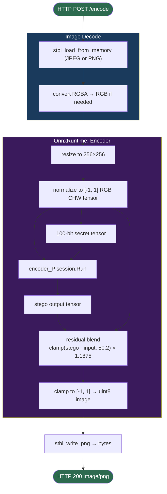

# TrustMark WASI Implementation

TrustMark WASI component — a WASIP2 binary that exports `wasi:http/incoming-handler` and imports `wasi:webgpu`. Runs in wasmCloud with the wasi-gfx WebGPU runtime.

| Route | Input | Output |
|-------|-------|--------|
| `POST /encode[?bits=<100-bit-string>]` | JPEG or PNG | Watermarked PNG |

See [BUILD.md](BUILD.md) for build and run instructions.

## Watermarking pipeline



## WebGPU execution

Set `USE_WEBGPU=1` (via `demo/trustmark-gpu/.wash/config.yaml`) to run ORT operators on GPU via `wasi:webgpu`. Without it, ORT uses CPU with MLAS SIMD.

## Performance (256×256 image, Apple M-series, Metal shader cache warm)

| Mode | Time |
|------|------|
| WASI CPU | ~0.93 s |
| WASI GPU | ~0.77 s |

## File structure

```
cpp/
├── wasm/                          # TrustMark WASI sources
│   ├── http_handler.cpp           # HTTP component entry point
│   ├── image_utils.cpp/h          # Image I/O (stb)
│   ├── stb_image*.h               # STB image libraries
│   ├── wasi_http/                 # wit-bindgen generated HTTP bindings
│   └── wasi_config/               # wit-bindgen generated config bindings
├── onnxruntime-wasi/              # Submodule (cdmurph32/onnxruntime wasi-main)
│   └── build_wasi/                # ORT build output (git ignored)
├── wit/                           # WIT interface definitions
│   ├── trustmark-http.wit
│   └── trustmark-config/
├── examples/                      # CLI entry point (staged into ORT build)
├── trustmark/                     # BCH ECC source
├── cmake/                         # CMake helpers
├── demo/
│   ├── trustmark-cpu/.wash/config.yaml   # port 8000, CPU
│   └── trustmark-gpu/.wash/config.yaml   # port 8001, GPU
├── models/                        # ORT model files (git ignored)
├── build_wasm_http.sh             # Component build script
├── prepare_ort_build.sh           # Stage sources into ORT before building
├── build.sh                       # Native C++ build
├── BUILD.md                       # Build and run instructions
└── README.md                      # This file
```
